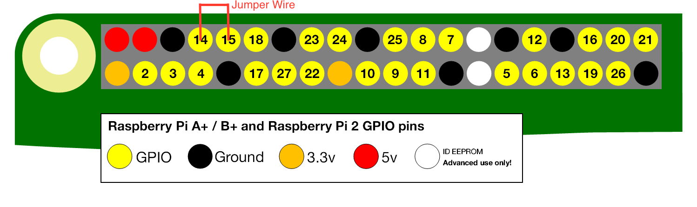
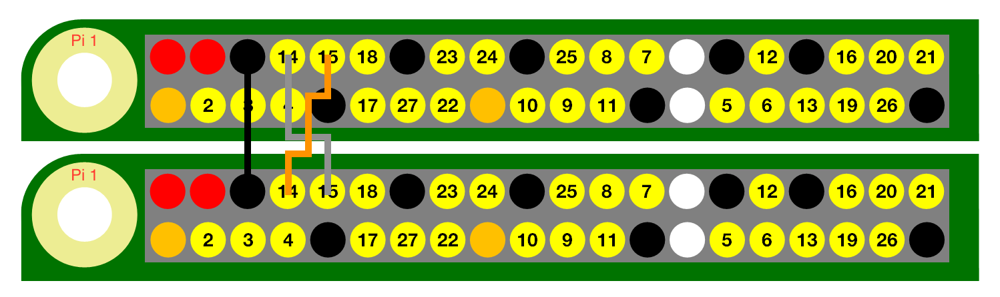

##Raspberry Pi Workshop

###Introduction and Starting Up
Welcome to the Raspberry Pi workshop. This workshop uses Raspberry Pi 3 and Zeros. All Pis are preconfigured so that one does not need to plug in a keyboard, mouse, and monitor to use (no BYODKM here). Just have your laptop ready with SSH capabilities.

Everything you need today is on the table:
 - Raspberry Pi 3 or Zero(with usb hub and usb wifi)
 - breadboard
 - two LEDs
 - two 330 ohm resistors
 - three female/female jumper wires
 - four female/male jumper wires

For those with a Raspberry Pi 3 in front of them, plug in the ac adapter to turn on. For those with the Pi Zero, please take the usb power cord and plug into your laptop.

All Pi’s have an ip address label on them. They should all be `10.10.1.X`, X being unique. To log in, power on the Pi. For the Pi 3, wait 15-20 seconds. For the Pi Zero, wait 30 seconds.

From your console: `$ ssh -X pi@<type ip on the board here>`

example: `$ ssh -X pi@10.10.1.40`

Since it will be your first time connecting, it’ll ask: `Are you sure you want to continue connecting?`
Type: `yes`

It will then ask for a password. The password is: `raspberry`

If you are curious as to how these were setup, they were all set to use the wireless connection here and with the following turned on: SSH, UART, I2C, and SPI. For details on how to do that refer to the links in the references at the end of this guide.

To turn off the Raspberry Pi, from console: `$ sudo shutdown -h now`
Your SSH connection will immediately end. On the Pi 3, you will see a blinking green light next to the red power light on the Pi. On the Pi Zero you will see a blinking green light near the power connector. Please wait until the green light stops flashing before you unplug the power cable.

**It is very important that you don't just unplug power. Shutdown command must be entered. This is because the Raspberry Pi file system is on an SD card and they are prown to corruption. I've experienced embedded systems similar to the Raspberry Pi lose its file system after 3-4 abrupt power offs.**

If at anytime you wish to reboot, from console: `$ sudo reboot now`. Your SSH session will end. Give it a few seconds before attempting reconnect.

Following is the pinout of the Raspberry Pi 3 that you will need to complete the exercises. For those that are using the Pi Zero the pinout is exactly the same if you position the Pi Zero to have its pins north.


###Turning on the LED using Python
We'll first learn how to connect an LED light and how to turn it on.

Go through this guide: [Turning on an LED with your Raspberry Pi's GPIO Pins](https://thepihut.com/blogs/raspberry-pi-tutorials/27968772-turning-on-an-led-with-your-raspberry-pis-gpio-pins)

This guide has a lot of good information on giving you the basic knowledge that I didn't feel I need to recreate. The following LED exercises will refer to the setup done in the guide.

###Turning on the LED using C code
Now that you are able to turn on an LED using Python. Let's try doing the same thing in C. This will still retain the same LED setup.

Create a new file called `ledwp.c` (from console you can use nano to create the file: `$ nano ledwp.c`) with the following content:
```C
#include <stdio.h>
#include <wiringPi.h>

#define ON  1
#define OFF 0
#define ERROR -1

int main (void)
{
  if (wiringPiSetupGpio() == ERROR)
    return 1;

  int port = 18;
  pinMode(port, OUTPUT);

  digitalWrite(port, ON);
  delay(1000);
  digitalWrite(port, OFF);

  return 0;
}
```

Once you are done typing the code. Save the file. If you had followed my recommendation of using nano, hit `Control + X`, and then `Y` to save, and enter to keep the file name the same. This will exit you out of nano.

Now we are ready to compile the code: `$ gcc ledwp.c -lwiringPi -o ledwp`

To run the code: `sudo ./ledwp`

###Wiring Pi
The C code earlier uses the Wiring Pi library to access the GPIO. The Wiring Pi library actually comes with a GPIO utility that you can call directly in the command line, do the following:
```
$ gpio -g mode 18 out
$ gpio -g write 18 1
$ gpio -g write 18 0
```
First line sets up GPIO 18 to be output. Second line turns on the LED. Last line turns off the LED.

The Wiring Pi library uses a different pin out than what we are using in this workshop. Their pin 0 is our pin 18. With the -g flag in the command above, it uses our pin numbers. The last argument is similar to the #define in our C code earlier: 1 means on and 0 means off.

###LED in C Again
So what if you don't want to be dependent on the Wiring Pi library? Is there a way to write code to turn on and off the LED? Yes you can. You can actually do direct register access. Let's create a `led.c` file and do the following (`$ nano led.c`):

note: If you are using the Pi 3, use the following as is. If you are on the Pi Zero, please comment out the line `#define BCM2708_PERI_BASE        0x3F000000` and uncomment the line below it `#define BCM2708_PERI_BASE        0x20000000`. This is because the register addresses differ between the two.

```C
#include <stdio.h>
#include <stdlib.h>
#include <fcntl.h>
#include <sys/mman.h>

#define BCM2708_PERI_BASE 0x3F000000  //for Pi 2 and 3
//#define BCM2708_PERI_BASE 0x20000000  //for Pi 1 and Zero
#define GPIO_BASE         (BCM2708_PERI_BASE + 0x200000) /* GPIO controller */

#define BLOCK_SIZE (4 * 1024)

// GPIO setup macros
#define GPFSEL(port) (port / 10) //returns the GPIO Function Select Register that controls the given port
#define LSD(n) (n % 10) //return least significant digit
#define GPFSEL_POS(port) (LSD(port) * 3) //returns starting location of GPIO port in the GPIO Function Select Register
#define INP_GPIO(gpio, port) *(gpio + GPFSEL(port)) &= ~(7 << GPFSEL_POS(port)) //set port to input
#define OUT_GPIO(gpio, port) *(gpio + GPFSEL(port)) |=  (1 << GPFSEL_POS(port)) //set port to output

#define GPSET0 7  //GPIO Pin Output Set 0 is the 7th register
#define GPCLR0 10 //GPIO Pin output Clear 0 is the 10th register
#define GPIO_SET(gpio) *(gpio + GPSET0)  // sets   bits which are 1 ignores bits which are 0
#define GPIO_CLR(gpio) *(gpio + GPCLR0) // clears bits which are 1 ignores bits which are 0
#define SET_BIT(n) (1 << n);

unsigned int *setup_io();

int main(int argc, char **argv)
{
  int port = 18;

  volatile unsigned *gpio = setup_io();

  INP_GPIO(gpio, port); //must use INP_GPIO before we can use OUT_GPIO
  OUT_GPIO(gpio, port);

  GPIO_SET(gpio) = SET_BIT(port);
  sleep(1);
  GPIO_CLR(gpio) = SET_BIT(port);

  return 0;
}

unsigned int *setup_io()
{
  int  mem_fd = open("/dev/mem", O_RDWR|O_SYNC);

  if (mem_fd < 0)
  {
    printf("can't open /dev/mem \n");
    exit(-1);
  }

  void *gpio_map = mmap(
                    NULL,                 //Any adddress in our space will do
                    BLOCK_SIZE,           //Map length
                    PROT_READ|PROT_WRITE, // Enable reading & writting to mapped memory
                    MAP_SHARED,           //Shared with other processes
                    mem_fd,               //File to map
                    GPIO_BASE             //Offset to GPIO peripheral
  );

  close(mem_fd);

  if (gpio_map == MAP_FAILED)
  {
    printf("mmap error %d\n", (int)gpio_map);
    exit(-1);
  }

  return (unsigned *)gpio_map;
}

```

To compile this: `$ gcc led.c -o led`

To run the code: `$ sudo ./led`

The GPIO setup macros are hard to understand and I did my best to clean that up as much as possible. Let me know if you want a detailed explanation on what they all do, or interest in another workshop/talk focused on just that.

###More to Explore with LEDs
Now that you are able to turn on the LED using Python and C, here are some things to try:
- What would you need to change in your code to make the led flash 5 times?
- What would you need to change in the code to add more LEDs to turn on/off?

###Serial UART loopback with Minicom
There are many ways to communicate on a Raspberry Pi and one of them is serial communication. Within serial there are multiple protocols and the Pi comes with the ability to do serial using [UART](https://en.wikipedia.org/wiki/Universal_asynchronous_receiver/transmitter), [I2C](https://en.wikipedia.org/wiki/I²C), and [SPI](https://en.wikipedia.org/wiki/Serial_Peripheral_Interface_Bus). We will focus on just UART today.

So how do you know if UART works on the Raspberry Pi? What I generally do is a simple loopback test where a mesage transmitted is immediately read back. One generally has to write code to write out data and read it back in but with a full Linux OS at our disposal, this is made simple by using the software [Minicom](https://en.wikipedia.org/wiki/Minicom). Minicom is installed on the Pi you are working with.

First we need to get the Pi physically ready. Using the supplied jumper cable, connect GPIO 14 UART_TXD to GPIO 15 UART_RXD.


With the UART transmit connected to its receive, we can now open Minicom.

If you are using the Pi 3, in console: `$ minicom -b 115200 -o -D /dev/serial0`

If you are using the Pi Zero, in console: `$ minicom -b 115200 -o -D /dev/ttyAMA0`

The program should now be open. You should see at the bottom of the screen 115200 8N1. This goes back to the option we had included when starting Minicom. `115200 8N1` means that we are operating at a baud rate of `115200` bits per second. `8N1` means 8 data bits, no parity, and 1 stop bit. Hardware and software flow control are also off. And finally, `/dev/serial0` is the port we are using. Raspberry Pi 3 uses `serial0` while other Pis (1, 2 and Zero) use `ttyAMA0`.

Try the following:
- Type on your keyboard. You should see what you typed appear on the screen. This is text that were sent out on the transmit line and read back in on the receive line.
- Now try disconnecting one end of the loopback (or the whole cable). Try typing something now. You will notice that nothing appears on the screen.
- Reconnect the loopback cable to connect GPIO 14 and 15 again. Try typing now. Text should now show up again.

To exit Minicom:
- press `Enter`
- control + A
- press `X`. It will ask if you want to leave minicom, press enter for yes and Minicom will now close.

So there you have it, serial loopback test without writing a single line of code!

###Serial UART loopback in C
To do the loopback test in C, create a serial.c file('nano serial.c') with the following:

note: If you are using the Pi 3 the following code can be used as is. If you are on the Pi Zero please comment out the line `#define DEVICE "/dev/serial0"` and uncomment the line below it `#define DEVICE "/dev/ttyAMA0"`

```C
#include <stdio.h>
#include <unistd.h>
#include <fcntl.h>
#include <termios.h>

#define DEVICE "/dev/serial0" //for Pi 3
//#define DEVICE "/dev/ttyAMA0"  //for Pi 1, 2, and Zero

#define FS_ERROR -1

int setup();
void transmit(int uart_filestream);
void receive(int uart_filestream);

int main()
{
  int uart0_filestream = setup();

  transmit(uart0_filestream);
  sleep(1);
  receive(uart0_filestream);

  close(uart0_filestream);
  return 0;
}

int setup()
{
  int uart_filestream = FS_ERROR;

  uart_filestream = open(DEVICE, O_RDWR | O_NOCTTY | O_NDELAY);

  if (uart_filestream == FS_ERROR)
  {
    printf("Error - Unable to open UART.  Ensure it is not in use by another application\n");
  }

  struct termios options;
  tcgetattr(uart_filestream, &options);
  options.c_cflag = B115200 | CS8 | CLOCAL | CREAD;
  options.c_iflag = IGNPAR;
  options.c_oflag = 0;
  options.c_lflag = 0;
  tcflush(uart_filestream, TCIFLUSH);
  tcsetattr(uart_filestream, TCSANOW, &options);

  return uart_filestream;
}

void transmit(int uart_filestream)
{
  int tx_buffer_size = 20;

  unsigned char tx_buffer[tx_buffer_size];

  printf("Enter text to send %d character limit: ", tx_buffer_size);
  scanf("%[^\n]s", tx_buffer);

  if (uart_filestream != FS_ERROR)
  {
    int bytes_written = write(uart_filestream, tx_buffer, tx_buffer_size);
    if (bytes_written < 0)
    {
      printf("UART TX error\n");
    }
  }
}

void receive(int uart_filestream)
{
  int rx_buffer_size = 256;

  if (uart_filestream != FS_ERROR)
  {
    unsigned char rx_buffer[rx_buffer_size];
    int bytes_read = read(uart_filestream, rx_buffer, rx_buffer_size);
    if (bytes_read < 0)
    {
      printf("UART RX error\n");
    }
    else if (bytes_read > 0)
    {
      printf("%i bytes read : %s\n", bytes_read, rx_buffer);
    }
  }
}
```
To compile this: `$ gcc serial.c -o serial`

To run the code: `$ ./serial`

###Serial UART Pi to Pi
Now that you can do a loopback, what if you want to connect to another Pi via UART?

To do this we need to connect two Pis together according to the following:


There are 3 wires total. We need to connect the ground together so the black line shown is the ground. This puts the two Pis on the same ground plane and without doing that serial transmission will not work.

Next, the tranmit of one Pi is connected to the receive of the other (depicted as the gray line). The receive of one Pi is connect to the transmit of the other (depicted as the orange line).

Work with another group to do this connection and determine if you need to make any changes to your code to make this happen.

###Serial UART Pi to Pi with Minicom
If you find that writing C code is too difficult, you can still use Minicom to test that the UART is transmitting correctly from one Pi to another using Minicom. Just make sure that both Pis are set to the same baud rate. As long as both Pis are using the same command as before to start Minicom everything should work fine: `$ minicom -b 115200 -o -D /dev/serial0`

###References:
####Recreating the Setup from the Workshop
If you'd like to recreate the setup from this Workshop, here are helpful links to get you setup at home.

[Jumper wires](https://www.amazon.com/gp/product/B01FSGGJLY/ref=oh_aui_detailpage_o03_s00?ie=UTF8&psc=1)

[Breadboard](https://www.amazon.com/Solderless-Breadboard-Circuit-Circboard-Prototyping/dp/B01DDI54II/ref=sr_1_2?ie=UTF8&qid=1488487594&sr=8-2-spons&keywords=breadboard&psc=1)

LED and resistors were from an Arduino kit but can be purchased at places like Fry's.

#####Pi 3
[LoveRPi Raspberry Pi 3 Complete Starter Kit - Clear Case](https://www.amazon.com/LoveRPi-Raspberry-Complete-Starter-Kit/dp/B01IYC0LT0/ref=sr_1_4?s=electronics&ie=UTF8&qid=1488487254&sr=1-4&keywords=raspberry+pi+3+starter+kit)
This kit comes with a Pi 3.

#####Pi Zero
[Pi Zero v1.3](http://www.microcenter.com/product/463189/Zero_v13_Development_Board_-_Camera_Ready)
Note: Micro Center only lets you buy 1 a month. You can buy more but have to pay double for each Pi Zero you buy.

[MakerSpot Pi Zero Starer Kit](http://makerspot.com/raspberry-pi-zero-mega-pack/)

####Setup
http://www.makeuseof.com/tag/setup-wi-fi-bluetooth-raspberry-pi-3/

https://learn.sparkfun.com/tutorials/raspberry-pi-spi-and-i2c-tutorial#i2c-on-pi

https://www.raspberrypi.org/forums/viewtopic.php?t=128458&p=859002\

####LED
http://elinux.org/RPi_GPIO_Code_Samples

http://wiringpi.com/examples/blink/

http://wiringpi.com/the-gpio-utility/

Direct register access is rather hard to understand so here are a few links on just that:
https://www.raspberrypi.org/forums/viewtopic.php?f=33&t=16982

https://www.raspberrypi.org/documentation/hardware/raspberrypi/bcm2835/BCM2835-ARM-Peripherals.pdf

http://elinux.org/BCM2835_datasheet_errata

####Serial UART
https://en.wikipedia.org/wiki/8-N-1

http://www.raspberry-projects.com/pi/programming-in-c/uart-serial-port/using-the-uart

https://hallard.me/enable-serial-port-on-raspberry-pi/

